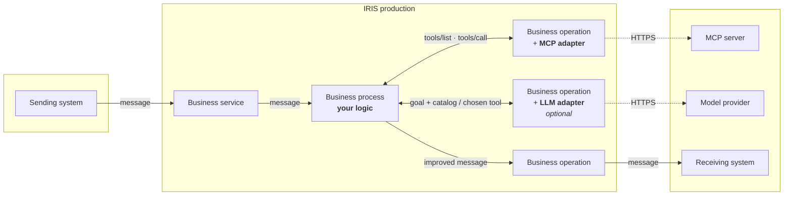
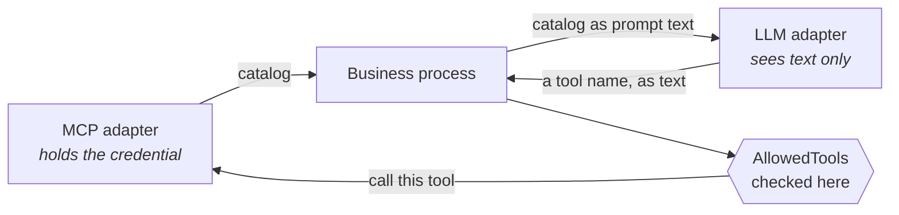

# Agentic Adapter in Execution Time

Call an MCP (Model Context Protocol) server from an InterSystems IRIS
interoperability production, while a message is in flight, configured rather than
coded.

Standalone module. Requires IRIS, IRIS for Health or Health Connect 2026.2 or later.

---

## The problem

An interoperability engine moves messages between systems. Increasingly, something
useful sits outside it that the interface would benefit from asking while a message
is in flight — a terminology service, an identity service, a mapping service, a
reference dataset, a model-backed service.

MCP has become the common way those services expose callable tools. Reaching one
from a production has meant writing code: a custom operation, a hand-rolled HTTP
client, an endpoint pasted into a setting, a token handled by hand, error semantics
invented afresh for every service.

This module makes that a configuration step, with the platform's own security and
audit behaviour.

**It is not about terminology.** Terminology is used in the examples because it is
concrete and easy to verify. The module knows about MCP and nothing else — no
message formats, no domain concepts. Arguments go in as JSON, a tool result comes
back as JSON.

---

## What is a feature, and what is your configuration

The most common confusion with this module is mistaking the examples for the
product. To be explicit:

| | |
|---|---|
| **The features** | Four: MCP connectivity, model-chosen tools, an extendable enrichment process, and functions for transformations. Shipped in `Agentic.*`, installed by IPM, generic |
| **Your configuration** | Which server, which tool, which credential, which field of your message. Set in the Management Portal |
| **Your code** | Where the values live in your message and what to do with the answer. Usually two methods, sometimes none |
| **The examples** | Everything under `Demo.*` in `examples/`. Not installed, not supported. Copy and adapt |

Nothing in `Agentic.*` mentions HL7, SNOMED, ICD or FHIR outside of a comment.

---

## The features

Four features across two levels, plus shared plumbing. The levels exist because IRIS
offers two places to call from and they have different vocabularies: an adapter has
to hang off a business host, and a transformation is not one.

### Production level features

Invoke agents or MCP servers while exchanging data — on interface execution time.

#### Feature 1 — MCP connectivity

| Class | What it is |
|---|---|
| `Agentic.Adapter.MCP` | Outbound adapter. Speaks MCP; inherits TLS, credentials, OAuth 2 and proxy from `EnsLib.HTTP.OutboundAdapter` |
| `Agentic.Adapter.Operation` | A ready-made business operation carrying it. Any operation of yours can carry it instead |
| `Agentic.Adapter.Msg.ToolRequest` / `ToolResponse` | The messages you send and receive |

Configure a server on it and send it a `ToolRequest`. Every call becomes a traced
production message with retry, failover and alerting.

`ToolRequest.Action` also does discovery: `list` returns the server's catalogue with
input schemas, `describe` returns one tool. That is how you find out what to
configure.

**Required.** This is the feature; everything else is optional around it.

#### Feature 2 — model-chosen tools

| Class | What it is |
|---|---|
| `Agentic.Adapter.LLM` | Outbound adapter for a model provider. Provider-neutral: `bedrock`, `anthropic`, `openai`, `custom` |
| `Agentic.Adapter.SelectorOperation` | Business operation carrying it. Takes a goal and a catalogue, returns a tool name and the reason |
| `Agentic.Adapter.Msg.SelectRequest` / `SelectResponse` | Its messages |

For when you cannot know the right tool until the message arrives. The model reads
the catalogue as text and answers with a tool name as text — it holds no credential
for the MCP server and cannot invoke anything. `AllowedTools` is checked between its
answer and the call.

Two things make it affordable and auditable:

- **Selections are cached**, keyed on whatever discriminates the case rather than on
  the value. Measured over 50 messages: 2 model calls, 48 cache hits.
- **Every selection is a traced message** carrying what the model was asked, what it
  chose and why.

`ConnectionName` points at a connection already configured in AI Settings, so the
provider, model, endpoint and key are inherited and a key is rotated in one place.

**Optional.** Nothing else in the module contacts a model. If you always know the
tool, you never install a selector.

#### Feature 3 — the enrichment process you extend

`Agentic.Adapter.EnrichmentProcess` — an abstract business process that owns
everything repetitive about calling a tool per value in a message:

- fetching the catalogue when it is needed
- choosing the tool, by `fixed` name, by `rule` from a value in the message, or by
  `model` through the selector
- invoking it, applying `ResultPath`, applying the error policy
- caching selections, logging, and declaring its connections to the production
  diagram

You subclass it and implement two methods — where the values live in your message,
and what to do with the answer:

```objectscript
Class My.Process Extends Agentic.Adapter.EnrichmentProcess
{
Method FindCandidates(pMessage As %Persistent, Output pSC As %Status) As %DynamicArray
Method ApplyResult(pMessage As %Persistent, pCandidate As %DynamicObject, pResult As %DynamicObject) As %Status
}
```

Or, in Python, `Candidates()` and `Apply()` — same hooks with the awkward parts
removed. Measured: no performance difference between the two.

It never touches your message itself; it only ever handles *candidates*, which are
plain JSON objects you produced. That is why the same base serves HL7, FHIR, X12 or
a class of your own.

**Optional.** It fits one common shape — find several values, enrich each, forward
the message. When your interface does something else, skip it: any process, BPL or
operation can send a `ToolRequest` directly.

### Transformation level features

Invoke agents or MCP servers while transforming data or applying rules — on data
execution time.

#### Feature 4 — the functions

| Function | What it is |
|---|---|
| `MCPCall(item, tool, argumentsJSON, resultPath, default)` | Call any tool with any arguments |
| `MCPLookup(item, tool, argument, value, resultPath, default)` | Shorthand for one named argument in, one value out |

Shipped in `Agentic.Adapter.Functions`. A one-line call from inside a DTL or a
routing rule condition, naming a production item so TLS and credentials come from
configuration rather than from the transformation.

No traced message, no retry, no OAuth 2. See [Choosing a level](#choosing-a-level).

### Shared

| Class | What it is |
|---|---|
| `Agentic.Adapter.Protocol` | The MCP wire protocol with no transport. Both levels use it, so they cannot drift |
| `Agentic.Adapter.ContextSearch` | Populates the connection dropdown in settings from AI Settings |
| `Agentic.Install` | Creates the shared database and maps it into every namespace. Run once |

### At a glance

| Feature | Level | Required? | You get |
|---|---|---|---|
| MCP adapter + operation | Production | Yes | Traced calls, retry, failover, OAuth 2, discovery |
| LLM adapter + selector | Production | No | A model picks the tool, cached and traced |
| `EnrichmentProcess` | Production | No | Orchestration; you write two methods |
| `MCPCall` / `MCPLookup` | Transformation | No | One-line call inside a transformation or a rule |

## Choosing a level

| | Adapter (productions) | Functions (DTL, rules) |
|---|---|---|
| Where you call from | A business process, BPL or operation | Inside a transformation or a rule condition |
| Moving parts | A process plus an operation | One function call |
| TLS | Yes | Yes |
| Credentials | Yes | Yes — bearer, basic |
| OAuth 2 | Yes | No |
| Proxy settings | Yes | No |
| In the Visual Trace | Its own message, with timing and body | Nothing |
| Retry, failover, alerting | The production's | None |
| A slow server | Times out and retries per configuration | Blocks the transformation |
| Model-chosen tools | Available | No |

Not secure versus insecure — both authenticate. The question is whether the call
needs to be an auditable, retryable event in its own right.

Rule of thumb: if someone might one day ask *"why did this value change?"*, use the
adapter. If it is a lookup that belongs in the mapping, use the function.

---

## Install — once per instance

Requires IRIS, IRIS for Health or Health Connect **2026.2 or later**. The module
refuses to install on anything earlier.

The code lives in a shared database mapped to every namespace, so you install once
and namespaces created later pick it up.

```
docker cp /path/to/Agentic-Adapter-in-Execution-Time <container>:/opt/mcpadapter
```

In an IRIS session:

```
do $system.OBJ.Load("/opt/mcpadapter/src/cls/Agentic/Install.cls","ck")
do ##class(Agentic.Install).Setup()
zpm "load /opt/mcpadapter"
```

`Setup()` creates the `AGENTICLIB` database, creates the `%ALL` pseudo-namespace if
the instance lacks one, and maps `Agentic.Adapter` into it.

**IPM must be enabled in the namespace you load from** — it is not enabled
everywhere by default, and `zpm` will tell you which namespaces have it. Any of them
works, because the mapping puts the code in the shared database wherever you load.

Confirm:

```
do ##class(Agentic.Install).Verify()
```

```
              FHIR : adapter visible
          HSCUSTOM : adapter visible
              USER : adapter visible
```

Only code is shared. Message data stays per-namespace. `Unmap()` reverses it.

### Common to both levels — the server, once

Whichever level you use, the server is configured in one place: a production item.

**1. TLS**, if the endpoint is `https`. System Administration → Security →
**SSL/TLS Configurations** → Create. Note the name.

**2. Credentials**, if the server needs them. Interoperability → Configure →
**Credentials** → Create. Put the API key or token in the **Password** field. It is
never typed into a setting or written to a production definition.

**3. OAuth 2**, if the server uses it. System Administration → Security →
**OAuth 2.0** → Client. Note the application name. *Production level only.*

**4. The item.** Interoperability → Configure → Production → **+** on Outbound
Hosts:

| Field | Value |
|---|---|
| Operation Class | `Agentic.Adapter.Operation` |
| Operation Name | something the interface will name, e.g. `TxLookup` |

Settings:

| Setting | Value |
|---|---|
| `ServerURL` | `https://terminology.example.com/mcp` — the whole address |
| `SSLConfig` | your TLS configuration |
| `Credentials` | your credential entry |
| `AuthType` | `bearer`, `basic`, or `oauth2` |
| `AllowedTools` | leave blank — you do not know a server's tools before you ask it |

That item is now the single place the server is configured. Both levels name it.

### Finding out what a server offers

You need a tool name, its argument names and its result shape before you configure
anything:

```
set sc=##class(Ens.Director).CreateBusinessService("EnsLib.Testing.Service",.svc)
set r=##class(Agentic.Adapter.Msg.ToolRequest).%New()
set r.Action="list"
set sc=svc.SendRequestSync("TxLookup",r,.resp)
write resp.ResultJSON
```

```json
[{"name": "translate_icd",
  "description": "Translate an ICD-10 diagnosis code to SNOMED CT.",
  "inputSchema": {"properties": {"code": {"type":"string"}}, "required": ["code"]},
  "permitted": true}, ...]
```

Everything you configure below comes from this: the tool name, the argument name,
and where the answer sits in the result.

---

## Production level — using the adapter in a production

### Step by step

**1.** Configure the MCP item as above.

**2.** Write a business process that calls it, or subclass
`Agentic.Adapter.EnrichmentProcess` (Feature 3) and implement two methods:

```objectscript
Class My.Process Extends Agentic.Adapter.EnrichmentProcess
{
/// Where the values live in MY message.
Method FindCandidates(pMessage As %Persistent, Output pSC As %Status) As %DynamicArray
{
    set tOut = []
    do tOut.%Push({"id": 4, "value": "E11.9", "system": "I10", "text": "..."})
    quit tOut
}

/// What to do with the answer.
Method ApplyResult(pMessage As %Persistent, pCandidate As %DynamicObject, pResult As %DynamicObject) As %Status
{
    do pMessage.SetValueAt(pResult.code, pCandidate.id_":5.1")
    quit $$$OK
}
}
```

Prefer Python? Override `Candidates()` and `Apply()` instead and write both in
Embedded Python. Measured: no performance difference. See
[docs/WRITING_THE_PROCESS.md](docs/WRITING_THE_PROCESS.md).

Do not want the base class at all? Any process, BPL or operation can send a
`ToolRequest` directly:

```objectscript
set tReq = ##class(Agentic.Adapter.Msg.ToolRequest).%New()
set tReq.ToolName = "translate_icd"
set tReq.ArgumentsJSON = {"code":"E11.9"}.%ToJSON()
set tSC = ..SendRequestSync("TxLookup", tReq, .tResp)
```

**3.** Add your process to the production and point it at the MCP item:

| Setting | Value |
|---|---|
| `MCPTarget` | `TxLookup` |
| `OutputTarget` | where the message goes next |
| `SelectionMode` | `fixed`, `rule` or `model` |

**4.** Start, send a message, and open Interoperability → View → **Message Viewer**.
Every call is there with its request and response bodies.

Full walkthrough with screenshots' worth of detail:
[docs/SETUP_WALKTHROUGH.md](docs/SETUP_WALKTHROUGH.md).

### Use cases that fit this level

Anything where the call is a step in the flow, not a detail of a mapping — and
anything an auditor might ask about later.

| Use case | Tool the server exposes | Why this level |
|---|---|---|
| **Terminology translation** — local codes to SNOMED before an analytics feed | `translate_icd`, `translate_loinc` | Clinical data changed in flight; you will be asked why |
| **Identity resolution** — resolve a patient or provider against a master index | `match_patient`, `resolve_npi` | Slow, fallible, and the match decision needs a record |
| **Eligibility or coverage check** — enrich an order before routing | `check_eligibility` | External payer service: needs OAuth 2, retry and a timeout |
| **Consent check** — confirm a disclosure is permitted before forwarding | `check_consent` | The answer is a compliance artefact; it must be traceable |
| **Document classification** — decide where an unstructured report should go | `classify_document` | Model-backed and non-deterministic; the reasoning must be recorded |
| **Record matching / dedup** — is this the same encounter we saw yesterday? | `find_duplicates` | Expensive call, benefits from retry and queueing |
| **Formulary or catalogue enrichment** — add pricing or substitution data | `lookup_formulary` | Third-party API behind OAuth 2 |

The common thread: the call is slow, authenticated with OAuth 2, non-deterministic,
or something you will need to justify.

---

## Transformation level — using the functions in a DTL or rule

### Where the configuration lives

A DTL is not a host and has nowhere to hang settings. It runs inside a business
process, a BPL or a routing rule. So the server settings live on a production item
and the transformation names it:

```
Production
├── HL7FileIn                    service
├── EnrichRouter                 business process, BPL or routing rule
│      └── <transform> MyDTL
│              └── MCPLookup("TxLookup", ...)     names the item ──┐
├── TxLookup   Agentic.Adapter.Operation   ◄──────────────────────┘
│                ServerURL / SSLConfig / Credentials / AuthType
└── HL7FileOut                   operation
```

Two things worth knowing, both verified:

- **The item does not have to be enabled.** Disabled, with no job running, a
  transformation still resolves its settings and calls the server. A server used
  only by DTLs is a pure configuration record.
- **The item must exist in the production the DTL runs in.** A transformation cannot
  name an item that lives only in another production.

The transformation therefore carries a name — never an endpoint, a certificate
reference or a secret.

### Step by step

**1.** Configure the MCP item as above. Leave it disabled if only DTLs use it.

**2.** Find the tool name, argument name and result path from the catalogue.

**3.** Write the assign:

```xml
<assign action='set'
        property='target.{PIDgrpgrp(1).ORCgrp(1).OBXgrp(1).OBX:5(1).2}'
        value='##class(Agentic.Adapter.Functions).MCPLookup(
                 "TxLookup", "translate_icd", "code",
                 source.{PIDgrpgrp(1).ORCgrp(1).OBXgrp(1).OBX:5(1).1},
                 "structuredContent.display",
                 source.{PIDgrpgrp(1).ORCgrp(1).OBXgrp(1).OBX:5(1).2})'/>
```

**4.** Run it. A known value is replaced; an unknown one keeps what it had.

Four things that are easy to get wrong, all covered in
[docs/DTL_STEP_BY_STEP.md](docs/DTL_STEP_BY_STEP.md): use `create='copy'`, use the
full group path, always pass the last argument as the default, and call the function
qualified with `##class(...)` — bare function names do not resolve in a
hand-authored DTL.

### Use cases that fit this level

Anything where the answer is a detail of the mapping, is fast, and nobody will audit
the call on its own.

| Use case | Call | Why this level |
|---|---|---|
| **Code description normalisation** — replace a sloppy description with the official one | `MCPLookup(item,"lookup_icd10","code",{OBX:5.1},…)` | Cosmetic correction; the code itself is unchanged |
| **Reference data lookup** — facility code to facility name | `MCPLookup(item,"lookup_facility","id",{PV1:3.4},…)` | Static data, fast, uninteresting to an auditor |
| **Unit normalisation** — vendor unit strings to UCUM | `MCPLookup(item,"normalise_unit","unit",{OBX:6.1},…)` | Field-level, belongs in the mapping |
| **Address standardisation** — tidy a free-text address | `MCPLookup(item,"normalise","address",{PID:11.1},…)` | One field in, one field out |
| **Free-text translation** — a comment into the receiving system's language | `MCPLookup(item,"translate","text",{NTE:3.1},…)` | Presentational |
| **Routing hint in a rule condition** — classify before deciding a destination | `MCPCall(item,"classify",…)` in a routing rule | The routing decision is already recorded; the hint is not the artefact |
| **Identifier format check** — flag a malformed identifier during mapping | `MCPLookup(item,"validate_id","id",{PID:3.1},…)` | Validation, not modification |

The common thread: fast, deterministic enough, and the value is the point rather
than the call.

### The same question, both levels

Terminology appears in both lists deliberately — *translation* belongs in the
production level because it changes clinical meaning and will be questioned, while
*description normalisation* belongs in the transformation level because it corrects a label
without touching the code. Same server, same tool family, different answer.

---

## Architecture



Solid lines are production messages — traced, individually retryable. Dashed lines
are the only two places anything leaves the production, both over TLS.

One message through the production level, from a real trace:

```
1  HL7FileIn    -> EnrichCodes    the message arrives
2  EnrichCodes  -> SnomedMCP      what tools does this server offer?
3  SnomedMCP    -> EnrichCodes    the catalogue
4  EnrichCodes  -> ToolSelector   the goal, the catalogue, the value
5  ToolSelector -> EnrichCodes    the chosen tool — usually from cache
6  EnrichCodes  -> SnomedMCP      call that tool
7  SnomedMCP    -> EnrichCodes    the result
8  EnrichCodes  -> HL7FileOut     the improved message
```

Steps 2 to 5 disappear when the tool is known in advance.

### The model never touches the tool server



The catalogue reaches the model as text and its answer comes back as text. It holds
no credential for the tool server and cannot invoke anything. A model that
hallucinates a tool name is refused by configuration it cannot see.

Richer diagrams: [docs/architecture.html](docs/architecture.html).

---

## Choosing a tool

Three ways, in increasing order of cost.

| Mode | How the tool is chosen | Cost | Deterministic |
|---|---|---|---|
| `fixed` | The MCP item's `ToolName` | none | yes |
| `rule` | A value in the message maps to a tool | none | yes |
| `model` | A model picks from the catalogue | tokens, latency | no |

An HL7 CWE field names its own coding system in the third component, so `rule` mode
usually answers what a model would be paid to re-derive. Reach for `model` when the
intent is genuinely open or the catalogue changes under you.

Model-chosen selections are cached on the discriminator, not the value — which tool
translates ICD does not depend on which ICD code it is. Measured over 50 messages:
**2 calls to Bedrock, 48 cache hits**.

---

## Error model

Two failure classes, deliberately distinguished.

| Class | Cause | Behaviour |
|---|---|---|
| Transport or protocol | Unreachable, failed handshake, non-JSON, tool not permitted | `OnErrorAction`: `fail`, `passthrough` or `default` |
| Tool failure | The tool ran and returned `isError` | The message does not fail. `IsError` is set and the result returned |

A terminology server saying "I do not recognise that code" is a data quality
finding, not an outage.

In the transformation level the same principle applies through the last argument: pass the
existing value as the default and a failed lookup leaves the field as it was. A
warning goes to the Event Log; the transformation succeeds.

---

## Performance

50 HL7 messages, full path, Bedrock choosing tools. Method and caveats in
[docs/BENCHMARK.md](docs/BENCHMARK.md).

| | Cold cache | Warm cache |
|---|---|---|
| 50 messages, file in to file out | 23 s | 3 s |
| Calls to Bedrock | 2 | 0 |

The two model calls are 20.6 s of the 23 s. Everything else — 50 file reads, 100 MCP
round trips, 400 traced messages — is about 3 s.

Process language makes no measurable difference: 3.59 s (Python) versus 3.65 s
(ObjectScript) over the same 50 messages, run concurrently in separate namespaces.

---

## Settings reference

### Inherited by both adapters from `EnsLib.HTTP.OutboundAdapter`

`HTTPServer`, `HTTPPort`, `URL`, `SSLConfig`, `SSLCheckServerIdentity`,
`Credentials`, `ConnectTimeout`, `ResponseTimeout`, `RetriesToFailover`, the proxy
settings, and the full OAuth 2 surface (`OAuth2ApplicationName`, `OAuth2GrantType`,
`OAuth2Scope`, `OAuth2AccessTokenPlacement`, `OAuth2GrantTypeSpecific`,
`OAuth2JWTSubject`).

### `Agentic.Adapter.MCP`

| Setting | Default | Purpose |
|---|---|---|
| `ServerURL` | | The whole address. Fills in host, port, path and TLS |
| `ProtocolVersion` | `2025-06-18` | Negotiated MCP version |
| `ClientName` | `IRIS-MCP-Adapter` | How IRIS names itself in the handshake |
| `AuthType` | `none` | `none`, `basic`, `bearer`, `header`, `oauth2` |
| `HeaderName` | `X-API-Key` | Header used when `AuthType` is `header` |
| `ToolName` | | Default tool |
| `AllowedTools` | | Blank allows every tool. Otherwise plain names, comma separated, `*` wildcard |
| `ResultPath` | | Dotted path into the result |
| `OnErrorAction` | `fail` | `fail`, `passthrough`, `default` |
| `DefaultValue` | | Returned when `OnErrorAction` is `default` |

### `Agentic.Adapter.LLM`

| Setting | Default | Purpose |
|---|---|---|
| `ConnectionName` | | Inherit everything from a connection in AI Settings |
| `ConnectionNamespace` | | Namespace holding that connection's data |
| `Provider` | `anthropic` | `bedrock`, `anthropic`, `openai`, `custom` |
| `Model` | | Model id as the provider expects it |
| `MaxTokens` | 512 | |
| `Temperature` | 0 | Choosing a tool should not be creative |
| `AuthType` | `apikey` | `none`, `apikey`, `bearer`, `header`, `oauth2` |
| `HeaderName` | `X-API-Key` | Header used when `AuthType` is `header` |
| `APIVersion` | `2023-06-01` | Sent as `anthropic-version`. Ignored by providers that do not use it |

Set `ConnectionName` and the rest are inherited from AI Settings; set them
individually only when there is no connection to point at.

### `Agentic.Adapter.SelectorOperation`

| Setting | Default | Purpose |
|---|---|---|
| `CacheEnabled` | 1 | Set it explicitly — blank means off |
| `CacheSeconds` | 86400 | Selections are stable; be generous |
| `RequireKnownTool` | 1 | Reject a tool that is not in the catalogue |

### `Agentic.Adapter.EnrichmentProcess`

| Setting | Default | Purpose |
|---|---|---|
| `MCPTarget` | `MCPServer` | Config name of the MCP item |
| `OutputTarget` | | Where the enriched message goes. Blank replies to the caller |
| `SelectionMode` | `fixed` | `fixed`, `rule`, `model` |
| `RuleMap` | | `I10=translate_icd,LN=translate_loinc` |
| `SelectorTarget` | `ToolSelector` | Config name of the selector item |
| `Goal` | | What to tell the model |
| `ResultPath` | `structuredContent` | Passed to the MCP call |
| `FailOnToolError` | 0 | Fail the message when a tool reports `isError` |

---

## MCP protocol coverage

Implemented: `initialize`, `notifications/initialized`, `tools/list` with
pagination, `tools/call` including `isError` and content blocks, `ping`. Streamable
HTTP. Responses are accepted as plain JSON or as an SSE stream, because real servers
use both.

Not implemented: resources, prompts, sampling, roots, server-initiated requests,
notification streams, `stdio` transport.

`stdio` means the client launches the server as a child process and talks over its
standard input and output — how desktop tools run local MCP servers. It has no
address, and an interface engine should not be spawning and supervising child
processes to reach one. If a server you need is stdio-only, put a small HTTP wrapper
in front of it.

---

## Trying it without any real servers

```
python3 tests/mock_mcp_server.py     # 127.0.0.1:8765
python3 tests/mock_llm_server.py     # 127.0.0.1:8766
python3 tests/terminology_mcp_server.py   # 127.0.0.1:8767, real data from tx.fhir.org
```

`examples/` holds productions wired to them. Everything there is `Demo.*` — an
example, not a shipped feature.

---

## Documentation

| | |
|---|---|
| [docs/SETUP_WALKTHROUGH.md](docs/SETUP_WALKTHROUGH.md) | Production level — building the production, both portal UIs, with troubleshooting |
| [docs/DTL_STEP_BY_STEP.md](docs/DTL_STEP_BY_STEP.md) | Transformation level — calling MCP from a DTL, step by step |
| [docs/WRITING_THE_PROCESS.md](docs/WRITING_THE_PROCESS.md) | Production level — the process class in full, ObjectScript and Python |
| [docs/EXAMPLE_HL7_ENRICHMENT.md](docs/EXAMPLE_HL7_ENRICHMENT.md) | The worked HL7 example in detail |
| [docs/EXAMPLE_REAL_TERMINOLOGY.md](docs/EXAMPLE_REAL_TERMINOLOGY.md) | Against the live HL7 FHIR terminology server |
| [docs/BENCHMARK.md](docs/BENCHMARK.md) | 50-message benchmark, and Python versus ObjectScript |
| [docs/architecture.html](docs/architecture.html) | Architecture diagrams |
| [docs/PRD.md](docs/PRD.md) | Product requirements, as user stories |
| [docs/02_Technical_Specification.md](docs/02_Technical_Specification.md) | Design decisions and what was verified |
| [docs/DTL_INLINE_CALLS.md](docs/DTL_INLINE_CALLS.md) | Design notes for the transformation level, including approaches dropped |
