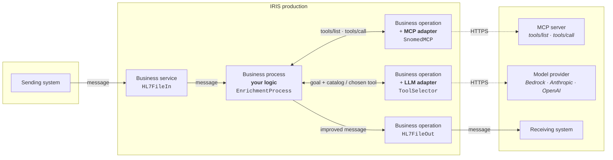
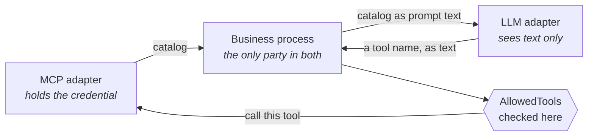

# Agentic Adapter in Execution Time

Call an MCP (Model Context Protocol) server from an InterSystems IRIS
interoperability production, while a message is in flight, configured rather than
coded.

Standalone module. No dependency on anything else. Works on IRIS, IRIS for Health
and Health Connect.

---

## The problem this solves

An interoperability engine moves messages between systems. Increasingly, something
useful sits outside it — a terminology service, a mapping service, a reference
dataset, a model-backed service — and the interface would be better if it could ask
that thing a question while the message is in flight.

MCP (Model Context Protocol) has become the common way those services expose
callable tools. Reaching one from a production has meant writing code: a custom
operation, a hand-rolled HTTP client, an endpoint pasted into a setting, a token
handled by hand, error semantics invented afresh for every service.

This module makes calling an MCP server a configuration step, with the platform's
own security and audit behaviour, from any production, on any message.

**It is not about terminology.** Terminology is the example used throughout this
documentation because it is concrete and easy to verify. The adapter knows about MCP
and nothing else — no message formats, no domain concepts, no healthcare. Arguments
go in as JSON, a tool result comes back as JSON. What you ask for and what you do
with the answer are entirely yours.

### How generic is it, really

Every domain word in the shipped module appears in a comment or an example. There is
no domain logic, no domain property and no domain assumption in any executable line.

The evidence is not just an audit. The same unchanged adapter has called:

- a terminology server, resolving real ICD-10, LOINC and SNOMED CT codes against the
  public HL7 FHIR terminology server
- **DeepWiki's `ask_question` tool**, a public MCP server on the internet that
  answers questions about GitHub repositories — nothing to do with healthcare,
  messages, or codes, and requiring no change to a single line

The minimum integration is one message and one call. Any business process, BPL or
custom operation can do this, from anywhere in a production:

```objectscript
set tReq = ##class(Agentic.Adapter.Msg.ToolRequest).%New()
set tReq.ToolName = "whatever_the_server_offers"
set tReq.ArgumentsJSON = {"anything":"you like"}.%ToJSON()
set tSC = ..SendRequestSync("MyMCPItem", tReq, .tResp)
```

That is the whole product surface. Everything else is convenience.

### What the convenience layer assumes, and when to ignore it

`Agentic.Adapter.EnrichmentProcess` encapsulates one common shape: *find several
values in a message, decide a tool for each, call it, write the answer back, forward
the message*. That shape covers a lot of real interfaces, which is why it exists —
it took the worked example from 255 lines to 78.

It is a helper, not a constraint. Use it when the shape fits. Do not use it when it
does not, and reach for the four lines above instead:

| What you want | Use |
|---|---|
| Enrich several values in a message | `EnrichmentProcess` |
| One call per message, not per value | Your own process, `SendRequestSync` |
| Use the answer to **route** rather than modify | Your own process or a BPL |
| Call a tool and forward nothing | A business operation of your own |
| Several different tools in sequence | A BPL, calling the MCP item repeatedly |
| Call from a DTL or routing rule | Works, with real trade-offs — see below |

None of those need a change to the adapter. They are different callers of the same
configured item.

#### Verified: calling it from a BPL

The MCP item is an ordinary business operation, so a graphical business process can
use it. This was tested, not assumed.

**1. The BPL.** One `<call>`, no ObjectScript of your own. The full class is
`examples/Demo/Process/CallMCPFromBPL.cls`, a plain `Ens.BusinessProcessBPL` that
inherits nothing from this module:

```xml
<process language='objectscript' request='Ens.StringRequest' response='Ens.StringResponse'>
<context>
  <property name='Answer' type='%String' initialexpression='""'/>
  <property name='Failed' type='%Boolean' initialexpression='0'/>
</context>
<sequence>

  <call name='Translate' target='SnomedMCP' async='0'>
    <request type='Agentic.Adapter.Msg.ToolRequest'>
      <assign property="callrequest.ToolName"       value='"translate_icd"' action="set"/>
      <assign property="callrequest.ArgumentsJSON"  value='"{""code"":"""_request.StringValue_"""}"' action="set"/>
      <assign property="callrequest.ResultPath"     value='"structuredContent.display"' action="set"/>
    </request>
    <response type='Agentic.Adapter.Msg.ToolResponse'>
      <assign property="context.Answer" value='callresponse.ResultJSON' action="set"/>
      <assign property="context.Failed" value='callresponse.IsError' action="set"/>
    </response>
  </call>

  <if name='Recognised' condition='context.Failed=0'>
    <true>
      <assign property="response.StringValue" value='context.Answer' action="set"/>
    </true>
    <false>
      <assign property="response.StringValue" value='"code not recognised"' action="set"/>
    </false>
  </if>

</sequence>
</process>
```

`target='SnomedMCP'` is the **config item name** of the MCP operation — not a class
name. That is the only coupling between the BPL and this module, besides the two
message types.

**2. The production item.** Add the BPL as a Process host. Nothing else to configure
— the server, credentials and TLS all live on the MCP item it calls:

```xml
<Item Name="BPLDemo" ClassName="Demo.Process.CallMCPFromBPL"
      PoolSize="1" Enabled="true" Category="Enrichment"/>
```

**3. The result**, run against the live production, both branches:

```
E11.9   ->  Diabetes mellitus type 2
NOPE.1  ->  code not recognised          (the isError branch)
```

and traced as ordinary production messages:

```
BPLDemo   -> SnomedMCP    ToolRequest
SnomedMCP -> BPLDemo      ToolResponse
BPLDemo   -> (caller)     StringResponse
```

So a team that builds its interfaces graphically never has to write a line of
ObjectScript to use an MCP server.

#### MCPLookup — the feature for transformations and rules

An adapter has to hang off a business host; that is what an adapter is. A
transformation is not a host, so there is no adapter shape available in that lane.
The feature there is a **function**.

| Lane | What you configure |
|---|---|
| Productions | `Agentic.Adapter.MCP` and `Agentic.Adapter.LLM`, on hosts |
| Transformations and rules | `MCPLookup`, naming a configured item |

Same protocol underneath — `Agentic.Adapter.Protocol` is shared — two surfaces,
because the two lanes have different vocabularies.

#### The standard way to call MCP from a DTL

`Agentic.Adapter.Functions` ships with the module. It is the same protocol code the
adapter uses — `Agentic.Adapter.Protocol` is shared by both, so the two cannot drift
— and it reads the endpoint, TLS configuration and credential from a named
production item, so a transformation names the server rather than embedding it.

In a DTL assign:

```
##class(Agentic.Adapter.Functions).MCPLookup("SnomedMCP","translate_icd",{OBX:5.1},"structuredContent.display")
```

Two functions are provided:

| Function | For |
|---|---|
| `MCPLookup(item, tool, value, path)` | one value in, one value out — the common case |
| `MCPCall(item, tool, argumentsJSON, path)` | arbitrary arguments |

`item` is a production item configured with `Agentic.Adapter.MCP`, or a plain URL if
you would rather not depend on a production at all.

**On bare function names.** IRIS resolves bare names like `Lookup()` inside a DTL by
inheritance, and this was tested rather than assumed: a bare call to a function from
a separately registered function set fails at runtime with `<UNDEFINED>` — and so, it
turns out, does the built-in `ToUpper()` in a hand-authored DTL. The qualified
`##class(...)` form is the one that works, so it is the one documented here. The
function set still extends `Ens.Rule.FunctionSet`, which registers it for the Rule
editor where bare names are the norm.

**What it costs.** The same three things as any transformation-time call: no
production message and so nothing in the Visual Trace, no retry or failover, and TLS
plus basic or bearer authentication but not OAuth 2. Failures are written to the
Event Log and the function returns an empty string rather than raising, because an
exception escaping a DTL fails the whole transformation.

**The transform.** One `<assign>`. The full class is
`examples/Demo/DTL/EnrichInline.cls`:

```xml
<transform sourceClass='EnsLib.HL7.Message' targetClass='EnsLib.HL7.Message'
           sourceDocType='2.5:ORU_R01' targetDocType='2.5:ORU_R01'
           create='copy' language='objectscript'>

  <assign action='set'
          value='##class(Agentic.Adapter.Functions).MCPLookup("SnomedMCP","translate_icd",source.{PIDgrpgrp(1).ORCgrp(1).OBXgrp(1).OBX:5(1).1},"structuredContent.display")'
          property='target.{PIDgrpgrp(1).ORCgrp(1).OBXgrp(1).OBX:5(1).2}'/>

</transform>
```

Read it right to left: take the code in OBX-5.1, ask the MCP server what it means,
put the answer in OBX-5.2. `create='copy'` matters — it carries the rest of the
message through untouched, and avoids the missing segment terminator that
`create='new'` produces on an HL7 target.

**3. The result**, running against a live server:

```
in   OBX-5:  E11.9^WRONG DESCRIPTION^I10
out  OBX-5:  E11.9^Diabetes mellitus type 2^I10
```

**4. What it depends on**, tested with the production stopped and the endpoint given
as a plain URL:

| | Needed? |
|---|---|
| A running production | No |
| A production item for the server | Only if you name one instead of passing a URL |
| `Agentic.Adapter.MCP` | No — the function speaks MCP itself |
| An interoperability-enabled namespace | Yes, because a DTL is itself an interoperability artifact |

#### Choosing between them

| | DTL inline | Business process |
|---|---|---|
| Moving parts | One function | A process plus an operation |
| In the Visual Trace | Nothing | Its own message, with timing and body |
| TLS | Yours to arrange | Inherited |
| Credentials, OAuth 2 | Bearer at best | Inherited |
| Retry, failover, alerting | None | The production's |
| A slow server | Blocks the transformation | Times out and retries per configuration |
| Model-chosen tools | Not available | Available |

Both are first-class; they answer different questions. `MCPLookup` is the right
answer when the call belongs in the transformation — a lookup, a normalisation, a
value you need in hand to finish mapping the message. The business process is the
right answer when the call needs to be a traced, retryable event in its own right,
or needs OAuth 2.

What `MCPLookup` gives up is real and worth knowing before you choose it: no
production message and so nothing in the Visual Trace, no retry or failover, and TLS
plus basic or bearer authentication but not OAuth 2. In a clinical interface those
usually decide it. In a transformation that normalises a units code against an
internal service, they usually do not.

There is a third shape if the one-line DTL ergonomics are what appeal: do the lookup
in a business process *before* the transform and pass the answer in. The DTL then
reads a value already in hand, and the call stays a traced, retryable message. That
is what the shipped `EnrichmentProcess` already does.

Full write-up, including why the function cannot simply borrow the adapter:
[docs/DTL_INLINE_CALLS.md](docs/DTL_INLINE_CALLS.md).

## Architecture



Solid lines are production messages: traced in the Message Viewer, individually
retryable. Dashed lines are the only two places anything leaves the production, both
over TLS with credentials the platform resolves.

Only the two operations reach outside, and each carries exactly one adapter for one
external system. The business process is the only component that talks to both — and
the only one you write.

### What happens to one message

Every hop is a real production message. This is a trace from a running instance:

```
1  HL7FileIn    -> EnrichCodes    the message arrives and is parsed
2  EnrichCodes  -> SnomedMCP      what tools does this server offer?
3  SnomedMCP    -> EnrichCodes    the catalog, with input schemas
4  EnrichCodes  -> ToolSelector   the goal, the catalog, the value in hand
5  ToolSelector -> EnrichCodes    the chosen tool and why — usually from cache
6  EnrichCodes  -> SnomedMCP      call that tool with these arguments
7  SnomedMCP    -> EnrichCodes    the result
8  EnrichCodes  -> HL7FileOut     the improved message, forwarded
```

Steps 2 to 5 disappear when the tool is known in advance. Configure a tool name, or
map a field in the message to one, and a message costs a single call — no catalog
fetch, no model, no cache.

### The model never touches the tool server



The two adapters have no connection to each other. Everything the model learns
arrives as text in a prompt and everything it decides comes back as text. It holds no
credential for the tool server, has no network path to it, and cannot invoke
anything. A model that hallucinates a tool name, or is argued into naming a
destructive one, is refused by configuration it can neither see nor influence.

Richer diagrams, including the full topology with both boundaries drawn:
[docs/architecture.html](docs/architecture.html).

## The pieces, and why there are four

Two adapters and two hosts. Each has one job.

| Component | Kind | Job |
|---|---|---|
| `Agentic.Adapter.MCP` | Outbound adapter | Speak MCP to a tool server |
| `Agentic.Adapter.Operation` | Business operation | Expose that adapter to the production |
| `Agentic.Adapter.LLM` | Outbound adapter | Speak to a model provider |
| `Agentic.Adapter.SelectorOperation` | Business operation | Ask a model which tool to call, and cache the answer |
| `Agentic.Adapter.EnrichmentProcess` | Business process, abstract | The orchestration you would otherwise rewrite every time |

### Why two adapters and not one

They are two different external systems, speaking two different protocols, with two
different credentials.

| | `Agentic.Adapter.MCP` | `Agentic.Adapter.LLM` |
|---|---|---|
| Talks to | An MCP server | A model provider |
| Protocol | JSON-RPC 2.0: `tools/list`, `tools/call` | Bedrock Converse, Anthropic Messages, OpenAI |
| Credential | The tool vendor's | Your AWS or Anthropic key |
| Fails when | The tool service is down | The model provider throttles you |

In IRIS one adapter means one external connection. Merging them would put two
vendors behind one host, and when something failed you could not say which — retry,
failover and timeout would all become ambiguous. They are separate for the same
reason a SQL adapter and an FTP adapter are separate.

## Worked scenario, end to end

An ORU arrives as a file. Its OBX carries a local ICD-10 diagnosis code. We want
SNOMED CT in the message before it goes downstream, without losing the original.
The terminology service is external, on the public internet, behind OAuth 2.

```
/tmp/hl7in → HL7FileIn → EnrichCodes ⇄ SnomedMCP  → HL7FileOut → /tmp/hl7out
                              ⇅
                         ToolSelector
```

### Step 1 — Install once, for the whole instance

**Requires IRIS, IRIS for Health or Health Connect 2026.2 or later.** The module
refuses to install on anything earlier — it depends on the OAuth 2 adapter settings
and on Embedded Python behaviour verified on that release.

The adapter lives in a shared database mapped to every namespace, so you install it
once and namespaces created later pick it up automatically.

```
docker cp /path/to/Agentic-Adapter-in-Execution-Time <container>:/opt/mcpadapter
```

In an IRIS session, create the shared database and the mapping:

```
do $system.OBJ.Load("/opt/mcpadapter/src/cls/Agentic/Install.cls","ck")
do ##class(Agentic.Install).Setup()
```

`Setup()` creates the `AGENTICLIB` database, creates the `%ALL` pseudo-namespace if
the instance lacks one, and maps the `Agentic.Adapter` package into it.

Then install the module:

```
zpm "load /opt/mcpadapter"
```

**IPM must be enabled in the namespace you load from.** It is not enabled everywhere
by default — `USER` and foundation namespaces often lack it, and `zpm` will tell you
which namespaces have it. Any of them will do, because the mapping puts the code in
the shared database wherever you load it. To enable it everywhere:
`zpm "enable -map -globally"`.

Confirm:

```
do ##class(Agentic.Install).Verify()
```

```
              FHIR : adapter visible
          HSCUSTOM : adapter visible
             HSLIB : adapter visible
             HSSYS : adapter visible
    HSSYSLOCALTEMP : adapter visible
             PAYER : adapter visible
              USER : adapter visible
```

Only code is shared. Message data stays per-namespace, so no production can see
another's traffic. `Unmap()` reverses the mapping and leaves the database in place.

Prefer a single namespace? Skip `Setup()` and just `zpm "load"` where you want it.

#### What gets installed

| Class | Purpose |
|---|---|
| `Agentic.Adapter.MCP` | The MCP outbound adapter |
| `Agentic.Adapter.Operation` | Ready-made business operation for it |
| `Agentic.Adapter.LLM` | Outbound adapter for a model provider |
| `Agentic.Adapter.SelectorOperation` | Asks a model which tool to call, and caches the answer |
| `Agentic.Adapter.EnrichmentProcess` | Abstract base for your enrichment process |
| `Agentic.Adapter.ContextSearch` | Dropdown provider for settings |
| `Agentic.Adapter.Msg.*` | Request and response messages |
| `Agentic.Install` | The installer. Deliberately not mapped — a one-time bootstrap |

### Step 2 — TLS

System Administration → Security → **SSL/TLS Configurations** → Create.

Name it something you will recognise in a setting, for example `mcp-tls`. Client
configuration, default trust settings unless your organisation says otherwise.

You need this for any `https` endpoint. Without it the connection fails at the
handshake and the operation goes red on start.

### Step 3 — Credentials

Interoperability → Configure → **Credentials** → Create.

| Field | Value |
|---|---|
| ID | `TerminologyMCP` |
| User name | anything, often the account name |
| Password | the API key or bearer token |

The adapter reads the password and never exposes it as a setting, never logs it, and
never writes it to a production definition. If your server takes a bearer token or an
API key header, this is where it goes.

### Step 4 — OAuth 2, if the server uses it

System Administration → Security → **OAuth 2.0** → Client → Create Client
Configuration. Register against the server's issuer, note the application name.

Then on the adapter set `AuthType` to `oauth2` and fill:

| Setting | Value |
|---|---|
| `OAuth2ApplicationName` | your client configuration name |
| `OAuth2GrantType` | usually `client_credentials` for unattended interfaces |
| `OAuth2Scope` | whatever the server issues |

Token acquisition, caching and refresh are handled by the platform, because the
adapter inherits `EnsLib.HTTP.OutboundAdapter`. There is no token code to write and
no refresh timer to manage. Use `Credentials` **or** OAuth 2, not both.

### Step 5 — The LLM connection (only if you want model-based tool selection)

Skip this entirely if you know which tool to call. See "Choosing a tool" below.

If you already have a connection configured in AI Settings, name it and the adapter
inherits everything:

| Setting on `ToolSelector` | Value |
|---|---|
| `ConnectionName` | `bedrock-default` |
| `ConnectionNamespace` | namespace holding the connection data, if not this one |

That resolves the provider, model, region, endpoint and API key at host start. For
Bedrock the endpoint becomes
`bedrock-runtime.<region>.amazonaws.com/model/<model>/converse` automatically. One
place to rotate a key or change model, for every production that references it.

No AI Settings? Configure the adapter directly instead: `Provider`
(`bedrock` / `anthropic` / `openai` / `custom`), `Model`, `HTTPServer`, `URL`,
`SSLConfig`, and `Credentials`.

### Step 6 — Build the production

Interoperability → Configure → **Production** → New. Then add four hosts.

The adapter is an **Outbound Host**. In the new Production Configuration UI, Create
asks for a host category first — choosing Process leads to a Process Type dropdown
(General / HL7 / X12 / Component) that does not apply here.

**HL7FileIn** — Inbound Host, `EnsLib.HL7.Service.FileService`

| Target | Setting | Value |
|---|---|---|
| Adapter | `FilePath` | `/tmp/hl7in` |
| Adapter | `FileSpec` | `*.hl7` |
| Adapter | `ArchivePath` | `/tmp/hl7archive` |
| Host | `TargetConfigNames` | `EnrichCodes` |
| Host | `MessageSchemaCategory` | `2.5` |

**SnomedMCP** — Outbound Host, `Agentic.Adapter.Operation`

| Target | Setting | Value |
|---|---|---|
| Adapter | `ServerURL` | `https://terminology.example.com/mcp` |
| Adapter | `Credentials` | `TerminologyMCP` |
| Adapter | `AuthType` | `bearer`, or `oauth2` |
| Adapter | `AllowedTools` | leave blank |
| Adapter | `OnErrorAction` | `fail` |

`ServerURL` is the whole address, pasted from the vendor's documentation. It fills
in host, port and path for you and picks the default TLS configuration for `https`.
Set `HTTPServer` / `HTTPPort` / `URL` / `SSLConfig` by hand only if you need finer
control.

Leave `AllowedTools` blank. You do not know a server's tool names before you call
it — finding out is what the server is for — and every shipped example leaves it
empty for exactly that reason.

It exists for the case where you *do* know and want this interface restricted to a
subset, for instance a server that also exposes tools that write. Then, and only
then, plain tool names with `*` as a wildcard:

```
lookup_*                          anything beginning lookup_
translate_icd, translate_loinc    exactly these two
```

Not regular expressions. Use the `list` action to see what a server actually offers
before restricting anything.

**ToolSelector** — Outbound Host, `Agentic.Adapter.SelectorOperation`

| Target | Setting | Value |
|---|---|---|
| Adapter | `ConnectionName` | pick from the dropdown, e.g. `bedrock-default` |
| Host | `CacheEnabled` | `1` |
| Host | `CacheSeconds` | `86400` |
| Host | `RequireKnownTool` | `1` |

**EnrichCodes** — Process Host, your subclass of `Agentic.Adapter.EnrichmentProcess`

| Setting | Value |
|---|---|
| `MCPTarget` | `SnomedMCP` |
| `SelectorTarget` | `ToolSelector` |
| `OutputTarget` | `HL7FileOut` |
| `SelectionMode` | `rule` or `model` |
| `RuleMap` | `I10=translate_icd,LN=translate_loinc,SCT=` |
| `Goal` | `Translate this observation code to SNOMED CT` |

**HL7FileOut** — Outbound Host, `EnsLib.HL7.Operation.FileOperation`, `FilePath`
`/tmp/hl7out`.

Note: settings declared but left blank come through empty rather than falling back
to their initial expression. Set `CacheEnabled` explicitly, or the cache is silently
off.

### Step 7 — Start it and send a message

Turn on **Testing Enabled** in the production settings first — the Test action needs
it, and without it you get `Business dispatch name 'EnsLib.Testing.Service' is not
registered to run`.

Drop a file into `/tmp/hl7in`:

```
MSH|^~\&|LAB|HOSP|EMR|HOSP|20260818120000||ORU^R01|MSG001|P|2.5
PID|1||123456^^^HOSP^MR||DOE^JOHN||19700101|M
OBR|1|ORD1|FILL1|PANEL^Panel^L
OBX|1|CWE|DIAG^Diagnosis^L||E11.9^Type 2 diabetes mellitus without complications^I10||||||F
```

Out the other side:

```
OBX|1|CWE|DIAG^Diagnosis^L||44054006^Diabetes mellitus type 2^SCT^E11.9^Type 2 diabetes mellitus without complications^I10||||||F
```

SNOMED in the primary CWE triplet, the original ICD-10 preserved in the alternate
triplet. A receiver that does not speak SNOMED can still read what was sent.

### Step 8 — Look at the trace

Interoperability → View → **Message Viewer**, open a message, click **Trace**.

```
#2147 01:19:09.534     HL7FileIn ->   EnrichCodes   HL7 Message
#2393 01:19:09.616   EnrichCodes ->     SnomedMCP   ToolRequest     tools/list
#2394 01:19:09.616     SnomedMCP ->   EnrichCodes   ToolResponse    the catalog
#2395 01:19:09.616   EnrichCodes ->  ToolSelector   SelectRequest   goal + catalog
#2396 01:19:09.617  ToolSelector ->   EnrichCodes   SelectResponse  the decision
#2397 01:19:09.617   EnrichCodes ->     SnomedMCP   ToolRequest     tools/call
#2398 01:19:09.617     SnomedMCP ->   EnrichCodes   ToolResponse    SNOMED result
#2399 01:19:09.617   EnrichCodes ->    HL7FileOut   HL7 Message
```

Every step is a real production message: replayable, searchable, individually
retryable. Open message 2395 and you see exactly what the model was asked; open 2396
and you see what it answered and why. That is the difference between an interface you
can audit and one you have to trust.

---

## Choosing a tool

Three ways, in increasing order of cost. Use the cheapest that answers the question.

| Mode | How the tool is chosen | Cost | Deterministic |
|---|---|---|---|
| `fixed` | The MCP item's configured `ToolName` | none | yes |
| `rule` | A value from the message maps to a tool via `RuleMap` | none | yes |
| `model` | A model picks from the server's catalog | tokens, latency | no |

Rule mode deserves more credit than it usually gets. An HL7 CWE field names its own
coding system in the third component — `I10`, `LN`, `SCT` — so the message already
says which translator it needs. A model asked to decide that is re-deriving something
the data states outright.

Model mode is the escape hatch: open intent, unfamiliar servers, or catalogs that
change under you.

### Discovering what a server offers

An MCP server never chooses a tool for you, and the protocol has no verb that takes
an intent. Before you can configure `ToolName`, you have to find out what exists:

```
set r=##class(Agentic.Adapter.Msg.ToolRequest).%New()
set r.Action="list"
set sc=svc.SendRequestSync("SnomedMCP",r,.resp)
write resp.ResultJSON
```

```json
[{"name": "translate_icd",
  "description": "Translate an ICD-10 diagnosis code to SNOMED CT.",
  "inputSchema": {"properties": {"code": {"type":"string"}}, "required": ["code"]},
  "permitted": true},
 {"name": "echo", "permitted": false}]
```

The catalog is deliberately not filtered by `AllowedTools` — you get everything,
annotated with what this item may call. Filtering here would hide what you are
missing; enforcement belongs at `CallTool`.

This is the design-time half of the workflow: discover the catalog and schemas,
decide which tool fits — the step where a model genuinely helps, at your desk rather
than in the message path — then pin the answer into configuration so runtime stays
deterministic.

### Caching is what makes model mode affordable

A selection is stable: which tool translates ICD does not depend on which ICD code it
is. So the decision is cached, and the key is the caller's to choose:

```objectscript
Method SelectionCacheKey(pCandidate As %DynamicObject) As %String
{
    quit ..Goal_"|"_pCandidate.system     ; the coding system, not the code
}
```

Get this wrong and the cost is invisible but large. Keying on the code means a model
call per distinct code. Keying on the coding system means one call per system, ever.
Measured on 50 messages: **2 calls to Bedrock, 48 cache hits**.

---

## Writing your own enrichment process

Subclass `Agentic.Adapter.EnrichmentProcess` and implement two methods. Everything
else — catalog, selection, tool invocation, caching, error policy, diagram
connections — is inherited.

```objectscript
Class Demo.Process.EnrichCodes Extends Agentic.Adapter.EnrichmentProcess
{

/// Where the values live in MY message.
Method FindCandidates(pMessage As EnsLib.HL7.Message, Output pSC As %Status) As %DynamicArray
{
    set tOut = []
    for i = 1:1:pMessage.SegCount {
        set tSeg = pMessage.GetSegmentAt(i)
        continue:(tSeg.Name '= ..SegmentType)
        set tCode = pMessage.GetValueAt(i_":"_..CodeField)
        continue:(tCode = "")
        do tOut.%Push({"id": (i), "value": (tCode),
                       "system": (pMessage.GetValueAt(i_":"_..SystemField)),
                       "text":   (pMessage.GetValueAt(i_":"_..TextField))})
    }
    quit tOut
}

/// What to do with the answer.
Method ApplyResult(pMessage As EnsLib.HL7.Message, pCandidate As %DynamicObject, pResult As %DynamicObject) As %Status
{
    set i = pCandidate.id
    do pMessage.SetValueAt(pResult.code, i_":"_..CodeField)
    do pMessage.SetValueAt(pResult.display, i_":"_..TextField)
    do pMessage.SetValueAt(..TargetSystemLabel, i_":"_..SystemField)
    do pMessage.SetValueAt(pCandidate.value, i_":"_..AltCodeField)
    quit $$$OK
}
}
```

The contract is a candidate: `{"id", "value", "system", "text"}`. `id` is whatever
you need to find your way back — a segment index here, a FHIR path or an X12 loop
reference elsewhere. The base class never touches the message, only the candidates,
which is why the same base works for HL7, FHIR, X12 or a custom class.

Optionally override `BuildArguments()` when a tool wants a different argument shape,
and `CloneMessage()` when a deep clone is not how your message should be copied.

The full example is 78 lines, and every line is HL7.

### ObjectScript or Python — no measurable difference

Both are shipped and both are supported. Choose on what your team reads comfortably.

Tested with two productions running concurrently in separate namespaces, one in each
language, the same 50 messages copied into both at the same moment, selection caches
warm, and a separate MCP server instance per namespace so neither waited on the other:

| | Python | ObjectScript |
|---|---|---|
| 50 messages, file in to file out | 3.59 s | 3.65 s |
| Difference | | 0.06 s, under 2% |

Isolated to the two methods alone, 5000 iterations against a real HL7 message,
ObjectScript is faster — by an amount that cannot be seen end to end:

| Method | ObjectScript | Python |
|---|---|---|
| find candidates | 23.8 us | 30.3 us |
| apply result | 28.6 us | 36.5 us |

About 15 microseconds per message against roughly 80,000 of end-to-end cost, or
under 0.02%. It would take around 65,000 messages to add up to one second.

An earlier run had Python ahead by 1.6 s in every one of four rounds. Swapping the
languages between the two namespaces collapsed the gap to 0.06 s, which showed the
difference belonged to that pair of productions rather than to either language.
Method and full numbers in [docs/BENCHMARK.md](docs/BENCHMARK.md).

**Prefer Python?** Override `Candidates()` and `Apply()` instead of
`FindCandidates()` and `ApplyResult()`, and write both entirely in Embedded Python.
They are the same hooks with the awkward parts removed — a JSON string instead of an
`Output` parameter, JSON strings instead of `%DynamicObject` arguments.
`Demo.Process.EnrichCodesPython` is the shipped example, and produces byte-identical
output to the ObjectScript one. Both are shown in full in
[docs/WRITING_THE_PROCESS.md](docs/WRITING_THE_PROCESS.md).

---

## Error model

Two failure classes, deliberately distinguished. Conflating them produces either
dropped clinical data or false alarms.

| Class | Cause | Behaviour |
|---|---|---|
| Transport or protocol | Server unreachable, handshake failed, non-JSON response, tool not permitted | `OnErrorAction`: `fail`, `passthrough`, or `default` |
| Tool failure | The tool ran and returned `isError` | The message does **not** fail. That candidate is left untouched and a warning is logged |

A terminology server saying "I do not recognise that code" is a data quality finding,
not an outage. Set `FailOnToolError` on the process if your flow disagrees.

This matters more than it looks. When a model once picked the wrong translator in
testing, the tool returned `isError`, the code was left as it arrived, and the message
went on unharmed. A bad decision degraded to "unchanged", not "silently corrupted".

---

## Performance

50 HL7 messages, full agentic path, Bedrock selecting tools. Details and method in
[docs/BENCHMARK.md](docs/BENCHMARK.md).

| | Cold cache | Warm cache |
|---|---|---|
| 50 messages, file in to file out | 23 s | 3 s |
| Calls to Bedrock | 2 | 0 |
| Average Bedrock latency | 10.3 s | — |

The two model calls are 20.6 s of the 23 s cold run. Everything else — 50 file reads,
100 MCP round trips, 400 traced messages, 50 file writes — is about 3 s. The cold
cost is paid once per deployment, not once per message.

---

## Settings reference

### Inherited by both adapters, from `EnsLib.HTTP.OutboundAdapter`

`HTTPServer`, `HTTPPort`, `URL`, `SSLConfig`, `SSLCheckServerIdentity`,
`Credentials`, `ConnectTimeout`, `ResponseTimeout`, `WriteTimeout`,
`RetriesToFailover`, `ProxyServer`, `ProxyPort`, `ProxyHTTPS`, `ExtraHeaders`, and
the full OAuth 2 surface (`OAuth2ApplicationName`, `OAuth2GrantType`, `OAuth2Scope`,
`OAuth2AccessTokenPlacement`, `OAuth2GrantTypeSpecific`, `OAuth2JWTSubject`).

### `Agentic.Adapter.MCP`

| Setting | Default | Purpose |
|---|---|---|
| `ProtocolVersion` | `2025-06-18` | MCP version negotiated |
| `ClientName` | `IRIS-MCP-Adapter` | Reported in the handshake |
| `AuthType` | `none` | `none`, `basic`, `bearer`, `header`, `oauth2` |
| `HeaderName` | `X-API-Key` | Header used when `AuthType` is `header` |
| `ServerURL` | | The server address as a URL. Fills in host, port, path and TLS |
| `ToolName` | | Default tool |
| `AllowedTools` | | Blank allows every tool the server offers. Otherwise plain names, comma separated, `*` wildcard |
| `ResultPath` | | Dotted path into the result, so callers get a scalar |
| `OnErrorAction` | `fail` | `fail`, `passthrough`, `default` |
| `DefaultValue` | | Returned under `OnErrorAction = default` |

### `Agentic.Adapter.LLM`

| Setting | Default | Purpose |
|---|---|---|
| `ConnectionName` | | Inherit everything from a connection in AI Settings |
| `ConnectionNamespace` | | Namespace holding that connection's data |
| `Provider` | `anthropic` | `bedrock`, `anthropic`, `openai`, `custom` |
| `Model` | | Model id as the provider expects it |
| `MaxTokens` | 512 | |
| `Temperature` | 0 | Choosing a tool should not be creative |
| `AuthType` | `apikey` | |
| `APIVersion` | `2023-06-01` | Anthropic only |

### `Agentic.Adapter.SelectorOperation`

| Setting | Default | Purpose |
|---|---|---|
| `CacheEnabled` | 1 | Set it explicitly — blank means off |
| `CacheSeconds` | 86400 | Selections are stable; be generous |
| `RequireKnownTool` | 1 | Reject a tool that is not in the catalog |

### `Agentic.Adapter.EnrichmentProcess`

| Setting | Default | Purpose |
|---|---|---|
| `MCPTarget` | `MCPServer` | Config name of the MCP item |
| `OutputTarget` | | Where the enriched message goes. Blank replies to the caller |
| `SelectionMode` | `fixed` | `fixed`, `rule`, `model` |
| `RuleMap` | | `I10=translate_icd,LN=translate_loinc,SCT=` |
| `SelectorTarget` | `ToolSelector` | Config name of the selector item |
| `Goal` | | What to tell the model |
| `ResultPath` | `structuredContent` | Passed to the MCP call |
| `FailOnToolError` | 0 | Fail the message when a tool reports `isError` |

---

## MCP protocol coverage

Implemented: `initialize` and `notifications/initialized` with capability
negotiation, session identity, `tools/list` with pagination, `tools/call` including
`isError` and content blocks, `ping`. Streamable HTTP transport.

Server responses are accepted as plain JSON or as an SSE stream, because real
servers use both.

Not implemented: resources, prompts, sampling, roots, server-initiated requests,
notification streams, and `stdio` transport.

**What `stdio` means, and why it is not here.** An MCP server can be reached two
ways. Over **HTTP**, it is a network service with a URL — what this adapter does.
Over **stdio**, there is no network at all: the client launches the server as a
child process on the same machine and talks to it through that process's standard
input and output. That is how desktop tools like Claude Desktop run local MCP
servers. It makes no sense for an interface engine — it would mean IRIS spawning and
supervising child processes on the production server, with their own environments,
lifetimes and orphan cleanup, to reach something that has no address. If a server you
want is stdio-only, run it behind a small HTTP wrapper and point `ServerURL` at
that.

---

## Is there a language model anywhere in this?

Only if you configure one. `Agentic.Adapter.SelectorOperation` is used solely when a
process sets `SelectionMode` to `model`, and it needs an endpoint and credentials
configured like any other outbound host. The MCP adapter itself never contacts a
model.

---

## Trying it without any real servers

`tests/mock_mcp_server.py` exposes `translate_icd`, `translate_loinc`,
`translate_code` and `echo`. `tests/mock_llm_server.py` stands in for a model.
Both are dependency-free.

```
python3 tests/mock_mcp_server.py     # 127.0.0.1:8765
python3 tests/mock_llm_server.py     # 127.0.0.1:8766
```

`examples/Demo/HL7Enrich.cls` is a production wired to them.
`examples/Demo/HL7EnrichRouted.cls` adds an HL7 routing engine in front, for when
more than one message type or destination is in play.

---

## Documentation

- [docs/SETUP_WALKTHROUGH.md](docs/SETUP_WALKTHROUGH.md) — portal walkthrough, both UIs, with a troubleshooting table
- [docs/EXAMPLE_HL7_ENRICHMENT.md](docs/EXAMPLE_HL7_ENRICHMENT.md) — the worked example in detail
- [docs/DTL_INLINE_CALLS.md](docs/DTL_INLINE_CALLS.md) — calling MCP from inside a DTL: verified, and what it costs
- [docs/architecture.html](docs/architecture.html) — architecture diagrams: the five hosts, the message path, and the model boundary
- [docs/WRITING_THE_PROCESS.md](docs/WRITING_THE_PROCESS.md) — the process class in full, in ObjectScript and in Python
- [docs/EXAMPLE_REAL_TERMINOLOGY.md](docs/EXAMPLE_REAL_TERMINOLOGY.md) — validating codes against the live HL7 terminology server
- [docs/BENCHMARK.md](docs/BENCHMARK.md) — 50-message benchmark and method
- [docs/PRD.md](docs/PRD.md) — product requirements, as user stories
- [docs/02_Technical_Specification.md](docs/02_Technical_Specification.md) — design decisions and what was verified
