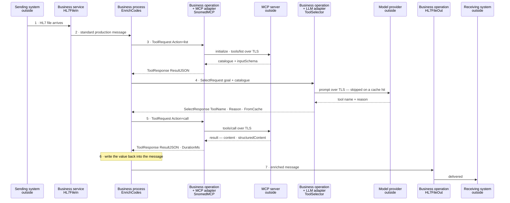

# Product Requirements Document

```
Product Initiative: Agentic Adapter in Execution Time
PM Owner:           Dan Franco
Status:             Draft
Last Updated:       2026-08-18
Product Area:       IRIS for Health / Health Connect — Interoperability Productions
```

---

> **How to read this document.** Sections 1 to 9 describe the need, from the
> customer's perspective, and are deliberately silent on how it might be met. Section
> 10 is a **proposed** solution — one shape that satisfies those needs, offered for
> challenge. If section 10 is wrong, sections 1 to 9 still stand.

---

## 1. Problem statement

### The customer problem

An interoperability engine moves messages between systems. Increasingly, something
useful sits outside it that the interface would benefit from asking while a message
is in flight — a terminology service, a mapping service, a reference dataset, a
model-backed service.

Maria is an integration engineer at a 400-bed health system, and she owns about
ninety interfaces. Her instance of this problem is codes: the lab sends ICD-10 where
the analytics platform wants SNOMED, one feed sends LOINC, another sends local codes
against a lookup table nobody has maintained since 2019. But the shape of the problem
is not specific to codes, and the next one she meets will not be. It might be
enriching an address, validating an identifier, classifying a document, or asking a
service what a segment maps to.

Whatever the question, reaching the service that answers it means writing code. A
custom business operation, a hand-rolled HTTP client, an endpoint pasted into a
setting or hard-coded, a token handled by hand, error semantics invented afresh.
Maria has written that code four times for four services, each slightly different,
each tested to a different standard. The engineer who wrote the oldest one left in
2023.

The cost is threefold. **Time**, because each new external capability is a small
development project rather than a configuration change. **Risk**, because
hand-rolled connectivity accumulates secrets in the wrong places and inconsistent
failure handling — and because when something goes wrong mid-interface, there is no
trace of what the external service was asked or what it said. **Opportunity**,
because when adding an external capability is expensive, teams do not do it. Problems
that could be fixed in flight get pushed downstream, or left alone.

### The business opportunity

MCP (Model Context Protocol) has become the common way for services to expose
callable tools, and the ecosystem is growing quickly — terminology, mapping,
retrieval, and model-backed services alike. The pattern is stable enough to build
against and early enough that being the interoperability engine where it "just plugs
in" is a differentiating position rather than table stakes.

Clinical data already flows through IRIS productions. If calling an external tool is
a configuration step inside that flow, the whole emerging service ecosystem becomes
reachable from where the data already is, governed by the platform's existing
security and audit model. Competing engines answer this with custom code in a
scripting step.

### Outcome hypothesis

If Maria can reach an external tool service by configuring it rather than by writing
code, adding an external capability becomes a task measured in minutes rather than
days, and it inherits TLS, credential, OAuth 2 and audit behaviour by default instead
of by discipline.

Leading indicator: time from "we should enrich this field" to a working, traced call
in a test production.

---

## 2. Value and risk assessment

| Risk dimension | Assessment | Mitigation |
|---|---|---|
| Value — will they use it? | Medium | MCP adoption is early. Mitigated by working for any HTTP JSON-RPC tool service, not only AI ones, and by a low build cost |
| Usability — can they figure it out? | Low | Configured the way every other outbound connection in a production is configured, using the vocabulary an interface engineer already has |
| Feasibility | Low | A working prototype exists and is described in §10 |
| Business viability | Low | Standalone module. No new licensing, runtime, or deployment change |
| Regulatory and compliance | **Medium-High** | Making an external call a configuration step also makes sending clinical data to a third party easy. See §5 |

The regulatory row governs adoption, not the technology. Nothing here is unsafe in
itself, but it turns sending message content to an external endpoint into a
configuration step. A customer sending PHI to a third party needs a business
associate agreement, needs to send the minimum necessary, and needs an audit trail.
The product's job is to make the safe path the easy one.

---

## 3. Personas

```
Maria — Integration Engineer
  Organization:  IDN, HIE, or Health Connect customer
  Job to be done: get a conformant message to the receiving system without
                  downstream complaints
  Influence:     end user and champion
```

```
Raj — Integration Architect
  Organization:  IDN, HIE, Payer
  Job to be done: standardize how interfaces reach outside services, and be able to
                  answer what called what
  Influence:     economic buyer, and potential blocker
```

```
Priya — Security and Compliance Officer
  Organization:  any covered entity
  Job to be done: ensure clinical data leaves the boundary only where permitted,
                  and is logged when it does
  Influence:     blocker
```

---

## 4. User stories

Tagged P0 for launch, P1 important, P2 desirable.

### Connecting to a service

- **P0** — As Maria, I need to register an external tool service by pasting the URL
  from its documentation, so that adding a service is configuration rather than a
  development ticket, and I am not decomposing an address into host, port and path by
  hand.
- **P0** — As Priya, I need credentials to resolve from the IRIS credential store or
  an OAuth 2 client configuration, so that no secret is typed into a setting, written
  to a production definition, or committed to source control.
- **P0** — As Priya, I need the connection to use our standard TLS configuration, so
  that certificate policy is set in one place and not per interface.
- **P1** — As Raj, I need OAuth 2 client credentials handled by the platform, so that
  token acquisition and refresh are not something each interface reimplements.
- **P1** — As Maria, I need to test the connection before wiring anything to it, so
  that I find configuration mistakes at build time rather than in a queue at 3 a.m.

### Knowing what a service can do

- **P0** — As Maria, I need to ask a service what tools it offers and what arguments
  they take, so that I can configure the right call without reading a vendor PDF.
- **P1** — As Maria, I need to see every tool a service offers even when my interface
  is only permitted to use some, so that I can tell what I am missing rather than
  what I already have.

### Making the call

- **P0** — As Maria, I need to send a value from the message to a named tool and get
  a structured answer back, so that I can use it in my transformation.
- **P0** — As Maria, I need the answer as a single value rather than a protocol
  envelope, so that my transformation is a line of code and not a parsing exercise.
- **P0** — As Maria, I need to write the answer back into the message and forward it,
  so that the interface produces an improved message rather than a report.
- **P1** — As Maria, I need one configured service to serve several call sites with
  different tools, so that I am not repeating the configuration once per tool.
- **P2** — As Maria, I need to call the service from inside a transformation, where
  field-level work naturally lives. *(Known obstacle — see the technical
  specification. Not in launch scope.)*

### Choosing the right tool

- **P0** — As Maria, when I know which tool I need, I need to name it and have it
  called every time, so that behaviour is reproducible.
- **P0** — As Maria, when the message itself says which tool applies — an HL7 CWE
  field names its own coding system — I need a mapping to decide, so that I am not
  paying anything to re-derive what the data already states.
- **P1** — As Maria, when I genuinely do not know which tool applies, I need a
  language model to choose from the service's catalogue, so that an unfamiliar or
  changing service is still usable.
- **P0** — As Raj, I need a model's choice to be cached, so that a decision that is
  the same for every message is paid for once rather than per message.
- **P0** — As Priya, I need the model to be unable to invoke anything directly, so
  that a wrong or manipulated answer cannot become an action.

### Calling from a transformation or a rule

A DTL never runs on its own. It runs inside a business process, a BPL or a routing
rule, in a production. So the question is not only "can a transformation call an MCP
server" but "where does that transformation get the server address, the TLS
configuration and the credential from".

- **P0** — As Maria, I need to call an MCP tool from inside a DTL, because that is
  where field-level work lives and I do not want a business process for a lookup.
- **P0** — As Maria, I need one supported, shipped mechanism rather than something
  each team writes for itself, so that ninety interfaces do not end up with ninety
  hand-rolled clients.
- **P0** — As Maria, I need that function to work with any tool on any server — the
  argument name and the result shape come from the server's catalogue, not from
  assumptions baked into the function.
- **P0** — As Priya, I need the transformation to use our TLS configuration and our
  stored credential, not a URL and a token pasted into a transformation.
- **P0** — As Raj, I need the server configured in exactly one place, so that
  rotating a credential does not mean editing transformations.
- **P1** — As Raj, I need that configuration to live somewhere that does not force a
  running host, so that a server used only by transformations does not consume a job.
- **P0** — As Maria, I need a failed lookup to leave the field as it was, so that
  enrichment never destroys the value it was meant to improve.
- **P1** — As Maria, I need a failed lookup to be visible in the Event Log, so that
  a server quietly returning nothing does not go unnoticed for a month.
- **P0** — As Maria, I need to know, before I choose this route, what it does not
  give me — no traced message, no retry, no OAuth 2 — so that I can choose the
  business process when those matter.

### Keeping it safe

- **P0** — As Priya, I need to be able to restrict which tools an interface may
  invoke, so that a service exposing destructive tools cannot be misused from a
  clinical flow — while the default remains "whatever the server offers", because
  Maria does not know a catalogue before she calls it.
- **P1** — As Maria, I need that restriction expressed as tool names, not as a
  regular expression, because I am configuring a production and not writing code.
- **P0** — As Maria, I need a tool that ran and reported failure to be distinguishable
  from a service that is down, so that I handle a bad code differently from an outage.
- **P0** — As Maria, I need to choose whether a failed enrichment fails the message,
  passes it through, or substitutes a default, so that enrichment never silently
  drops clinical data.
- **P0** — As Raj, I need every call to the external service to appear as a traced
  message, so that six months later I can answer why a code was changed.
- **P1** — As Priya, I need to know what a model was asked and what it answered, so
  that a non-deterministic decision in a clinical flow is still auditable.
- **P1** — As Priya, I need payloads and secrets kept out of the Event Log, so that
  logging does not itself become a disclosure.

### Operating it

- **P0** — As Raj, I need to install once per instance and have every namespace see
  it, so that I am not repeating deployment per namespace.
- **P0** — As Raj, I need it to install as a standard package on any supported IRIS,
  so that deployment is the same as everything else I run.
- **P1** — As Raj, I need it to refuse to install on an unsupported version, so that
  I find out at install time rather than from a failed interface.
- **P1** — As Raj, I need message data to stay namespace-local, so that one
  production cannot see another's traffic.
- **P1** — As Raj, I need to name a model connection already configured elsewhere,
  so that rotating a key or changing model is one edit rather than one per interface.
- **P1** — As Maria, I need to pick that connection from a list of what is actually
  configured, so that I am not typing a name from memory and discovering the typo at
  runtime.
- **P1** — As Maria, I need a per-call timeout below the calling host's own, so that
  a slow service backs off rather than backing up a queue.
- **P2** — As Raj, I need throughput figures for a realistic message volume, so that
  I can size this before committing to it.

### Building an interface with it

- **P0** — As Maria, I need to write only the part that is specific to my message —
  where the values are and where the answer goes — so that I am not reimplementing
  protocol handling per interface.
- **P1** — As Maria, I need the same approach to work for HL7, FHIR and X12, so that
  learning it once pays off across the estate.
- **P0** — As Maria, I need to call an MCP tool from anywhere in a production —
  my own process, a BPL, an operation I already have — and not only through something
  that assumes a particular shape of work, so that the mechanism fits my interface
  rather than the other way round.
- **P1** — As Maria, I need to write that part in ObjectScript or in Python,
  whichever my team maintains, without a performance penalty for choosing.

---

## 5. Non-functional and healthcare requirements

**Performance**
- Overhead beyond the remote service itself must be negligible against network time.
- The implementation language an interface team chooses must not be a performance
  consideration.
- Where a model is involved, the same judgement must not be paid for on every
  message, or the cost is not viable at interface volumes.
- Per-call timeout configurable and below the calling host's response timeout.

**Security**
- Every request traverses the platform's HTTP machinery, so TLS, credentials, OAuth 2
  and proxy settings always apply. Bypassing it is a defect, not an option.
- Secrets never appear in settings, logs, traces, production definitions, or source.
- Tool invocation is deny-by-default.
- A model can name a tool; it cannot invoke one. Enforcement sits between the two.

**Healthcare-specific**
- **Minimum necessary.** The design sends only the fields a tool needs — a code, not
  a patient, not a message. Documentation must be explicit that a business associate
  agreement is the customer's responsibility.
- **Audit.** Every invocation attributable: which item, which service, which tool,
  when, how long, success or failure. Tool arguments and results are message content
  and are traced as messages, not duplicated into logs.
- **Logging.** No PHI and no secrets in the Event Log.
- **Non-determinism.** Where a model chooses the tool, caching, full tracing and an
  explicit failure policy are the controls. Clinical use of a non-deterministic step
  is a customer decision that the audit trail must be able to support.

---

## 6. Anti-goals

- Not an MCP server. Exposing IRIS tools to external clients is a different product.
- Not an agent framework. It calls tools; it does not plan or loop.
- Not a transformation engine. What to do with an answer belongs to the interface.
- Not `stdio` transport. Spawning child processes from an IRIS job is a materially
  different operational story.
- Not a replacement for a lookup table where a local table is the right answer.

---

## 7. Success metrics

**Customer (leading)**
- Time to add an external enrichment step: target under 30 minutes from a standing
  start, versus days for a hand-written operation.
- Distinct interfaces in an account using it after 90 days.
- Connectivity code written per additional service after the first: zero.

**Business (lagging)**
- Accounts with at least one production interface using it.
- Attach rate in interoperability deals where AI-era services are discussed.

---

## 8. Open questions

| # | Question | Owner | Status |
|---|---|---|---|
| 1 | Minimum supported version is set at 2026.2 and enforced at install. Whether earlier releases could be supported is untested | Eng | Open |
| 2 | Does any target service need OAuth 2 flows beyond client credentials? | Eng | Open |
| 3 | Should one configured service ever fan out across several endpoints? | PM | Open |
| 4 | Guidance on clinical data leaving the boundary — formal position, or reviewed documentation? | Compliance | Open |
| 5 | Distribution: internal module, Open Exchange, or supported component? | PM | Open |
| 6 | Calling from inside a transformation — which mechanism best satisfies the stories in §4? Candidates and their trade-offs in §10.4 | PM, Eng | Open |

---

## 9. Appendix — competitive context

Rhapsody and Mirth both require a custom code step to call an external service
mid-interface, with connectivity, credentials and error handling written per
integration. Neither offers a configured, protocol-aware component with an inherited
enterprise security model.

The differentiator is not that IRIS can call an HTTP service — every engine can. It
is that the call can be configured rather than coded, inherits TLS, credential and
OAuth 2 handling, appears in the Visual Trace, can be restricted to an allow-listed
set of tools, and — when a model is involved — records what it was asked and why it
answered as it did.

---

## 10. Proposed solution

Everything above is the need. This section is a **proposal** for meeting it — one
shape that satisfies the stories in §4, offered for challenge rather than as a
specification. A different shape that satisfies the same stories is equally valid;
what is not negotiable is §4, §5 and §6.

A working prototype of this proposal exists, which is why §2 rates feasibility low.
Its measured behaviour is at the end of this section.

### 10.1 Two moments, not one

An interface can reach out at two distinct moments, and the stories in §4 split along
exactly that line.

- **Production level** — reach out while exchanging data, at interface execution
  time. This is where §4's *Connecting to a service*, *Making the call*, *Choosing the
  right tool* and *Operating it* stories live. The call is an event in its own right,
  so it can be traced, retried and failed over.
- **Transformation level** — reach out while transforming data or applying rules, at
  data execution time. This is where §4's *Calling from a transformation or a rule*
  stories live. The call is part of a mapping, so it is cheap and inline, and it
  cannot be an independently retried event.

The proposal covers both because §4 asks for both, and because the trade-off between
them is a decision the interface engineer should be able to make per interface rather
than have made for them.

### 10.2 What the customer configures, and what the customer writes

The distinction matters because it is what the stories about maintenance and reuse
actually turn on.

| | |
|---|---|
| **Shipped, generic** | Connectivity and protocol handling, tool discovery, optional model-based tool selection, and a reusable orchestration base — none of which knows what HL7, FHIR or X12 is |
| **Customer configuration** | Which service, which tool, which credential, which field — set in the Management Portal |
| **Customer code** | Only where the values live in their message, and what to do with the answer |
| **Examples** | Reference material. Not installed, not supported |

### 10.3 The proposed flow, step by step

Seven steps. Each one states what happens and, more importantly, which need from §4
it is there to satisfy.


Solid arrows are requests, dashed arrows are the replies. Everything except the
participants marked `outside` is a component the customer configured.

**1 · The message arrives.** A standard business service — file, TCP with MLLP
framing, FTP, REST — exactly as it does today.
*Satisfies:* nothing changes at the edge, so adding an external call to a live
interface does not mean re-testing how that interface receives.

**2 · It is handed to a business process.** The process holds the interface's own
logic: which values matter, and what to do with an answer.
*Satisfies:* the §4 stories about writing only the part specific to my message, and
about the same approach working for HL7, FHIR and X12 — knowledge of the message
format lives in one place and nowhere else.

**3 · Ask the service what it can do.** A standard request to a configured component
that holds the address, TLS configuration, credential, protocol version, permitted
tools and error policy. **What comes back** is the catalogue: every tool with its
description and input schema, each annotated with whether this interface may call it.
*Satisfies:* the §4 stories about discovering what a service offers without reading a
vendor PDF, about seeing every tool even where the interface may only use some, and
about the address and secret living in configuration rather than in code.

**4 · Decide which tool to use — only when it cannot be known in advance.** The goal
and the catalogue go to a model as text; a tool name and a reason come back as text.
The model holds no credential for the tool service and has no path to it; the
allow-list is checked between its answer and the call. The judgement is cached on
whatever discriminates the case, not on the value.
*Satisfies:* the §4 stories about the model being unable to invoke anything directly,
about paying once for a judgement that is the same for every message, and about
recording what was asked and why it answered as it did.

**5 · Call the tool.** The same configured component as step 3, now invoking. **What
comes back** is the tool result, reduced to the single value the interface asked for,
with the call duration attached.
*Satisfies:* the §4 stories about getting an answer as a value rather than a protocol
envelope, and the §5 requirement that an unreachable service behaves like every other
unreachable endpoint — retry, failover, alert, message preserved.

**6 · Apply the answer.** Write the value in, reject the message, or route on it. The
error policy decides what happens when a value cannot be resolved: fail, pass through
unchanged, or substitute a default.
*Satisfies:* the §4 story that a failed lookup must never destroy the value it was
meant to improve. Whether an unresolved value is a data quality finding or a broken
interface is a decision only the customer can make.

**7 · Forward it.** A standard business operation. The receiving system gets an
improved message through the channel it always used.
*Satisfies:* the §6 anti-goal — this is not a transformation engine and not a new
integration pattern. The interface still ends where it always did.

**Steps 3 and 4 are optional.** Where the tool is known at build time, the flow is
steps 1, 2, 5, 6, 7 — a single round trip, no catalogue fetch, no model, no cache.
Discovery belongs to build time and the model is an escape hatch, so the default path
stays deterministic.

### 10.4 The transformation level

The same seven steps collapse to one call made from inside a mapping. The open
question §4 raises — where a transformation gets its address, TLS configuration and
credential from, given that a transformation is not a host and has nowhere to hold
settings — is answered by having the transformation *name* a configured component
rather than carry its details. The named component need not be running; it can serve
purely as a configuration record, and the same one serves the production level when
both are in use.

The trade-off is real and must be stated to the customer rather than hidden: this
route inherits TLS and credentials but not OAuth 2, not proxy settings, and not the
traced, retryable message. §4 asks for exactly that disclosure.

Two candidate mechanisms were considered for open question 6. A pair of shipped
functions callable from a mapping, which the prototype uses; and a custom
transformation action, which would read more naturally in the visual editor but whose
feasibility on the target platform is unestablished. A third — inheriting the
functions so they resolve by bare name inside a mapping — was tried and abandoned:
bare names do not resolve in a hand-authored transformation, and shipping something
that only works in the visual editor would be a trap.

### 10.5 What the prototype measured

Evidence that the proposal is buildable, not a claim about the finished product.

| | |
|---|---|
| Throughput | 50 messages producing 400 traced production messages in about 3 s, selections cached |
| Language neutrality | 3.59 s versus 3.65 s over 50 messages, the two implementation languages run concurrently in separate namespaces — under 2% apart, and about 15 µs per message when isolated to the methods themselves |
| Selection cost | 2 model calls served 50 messages |
| Interoperability | Verified against live third-party services, including ones that reply over server-sent events rather than plain JSON |

### 10.6 Where this proposal could be wrong

- The two-level split assumes interface engineers want the choice. If they do not,
  one level and clear guidance would be simpler.
- Model-based selection may prove unnecessary in practice if tools are nearly always
  known at build time. It is optional precisely because that is unresolved.
- Caching a judgement assumes the right cache key is discoverable per interface. Where
  it is not, the economics change.
